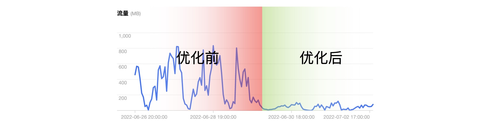

# Thu chi và Quyên góp

Cách thức quyên góp: Nạp điện dưới [video này](https://www.bilibili.com/video/BV19P4y1j7n6/), thu nhập nạp điện từ video này sẽ được dùng toàn bộ cho chi phí máy chủ của trang web này.

Cảm ơn mọi người đã quyên góp. Do phiên bản 2.0 tập trung tối ưu hóa tiêu thụ lưu lượng, dự kiến chi phí lưu lượng tháng 7 sẽ giảm đáng kể, dưới đây là tình hình lưu lượng sau khi cập nhật phiên bản 2.0.

Tình hình thu chi

| Tháng | Chi phí (Lưu lượng) | Thu nhập | Tổng cộng | Ghi chú |
| --------- | -------------- | ----- | ------- | ---------------------- |
| Tháng 1/2022 | -120.26 | 0 | -120.26 | Bao gồm phí đăng ký tên miền 101.66 tệ |
| Tháng 2/2022 | -45.44 | 0 | -45.44 | |
| Tháng 3/2022 | -46.18 | 0 | -46.18 | |
| Tháng 4/2022 | -65.85 | 0 | -65.85 | |
| Tháng 5/2022 | -62.45 | 0 | -62.45 | |
| Tháng 6/2022 | -61.74 | 51.42 | -10.32 | Bắt đầu chấp nhận quyên góp |

Chi tiết nạp điện (Tính đến ngày 4 tháng 7 năm 2022)

| Thời gian | ID | Thu nhập | Loại | Nền tảng |
| ------------------- | -------------------- | ----- | ---- | ------ |
| 2022-07-04 14:39:14 | _saber_e | 1.34 | Vỏ sò | Web |
| 2022-07-04 09:43:39 | 佐佐木小次品 | 4.03 | Vỏ sò | Android |
| 2022-07-03 19:58:10 | 万丈龙你 | 4.03 | Vỏ sò | Android |
| 2022/7/2 15:39 | 泠雨枫华丶 | 59.14 | Vỏ sò | Web |
| 2022/7/1 17:58 | 双子绝世 | 33.6 | Vỏ sò | Web |
| 2022/7/1 12:39 | sakura1984s | 6.72 | Vỏ sò | Web |
| 2022/6/30 19:25 | 一染墨辰 | 6.72 | Vỏ sò | Web |
| 2022/6/29 21:47 | 甜笑为别 | 1.34 | Vỏ sò | Web |
| 2022/6/28 00:11 | pixel3用户 | 1.34 | Vỏ sò | Android |
| 2022/6/28 00:11 | pixel3用户 | 1.34 | Vỏ sò | Android |
| 2022/6/24 21:14 | O了个cean | 1.7 | Vỏ sò | iOS |
| 2022/6/22 21:50 | 吴亦冰凡 | 18.83 | Vỏ sò | Đa nền tảng |
| 2022/6/20 23:31 | 绯認 | 4.03 | Vỏ sò | Web |
| 2022/6/20 23:31 | 绯認 | 4.03 | Vỏ sò | Web |
| 2022/6/12 21:43 | 战略性划水 | 4.03 | Vỏ sò | Web |
| 2022/6/12 21:38 | 战略性划水 | 4.03 | Vỏ sò | Web |
| 2022/6/12 09:14 | 某不愿透漏姓名的玩家 | 4.03 | Vỏ sò | Web |